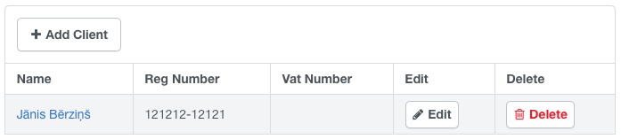
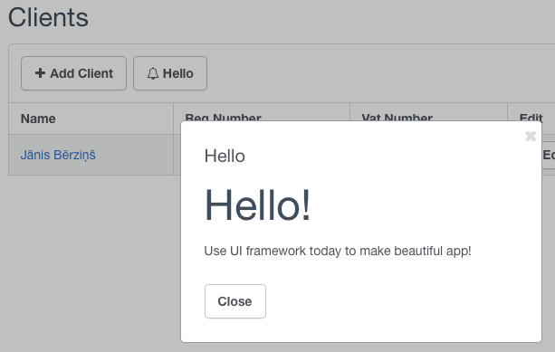

# Agile UI

**PHP library for building consistent Web User Interfaces.**

Many developers today have acknowledged that use of CSS framework is pretty essential to rapid development. Agile UI takes it to the next level and integrates CSS framework elements with a server-side PHP classes. 

As a PHP developer, you get flexible and extensive UI out of the box that's built around popular CSS framework(s). Here is how you can use Agile UI in ANY framework / PHP application:

``` php
$cr = new \atk4\ui\CRUD();
$cr->setModel(new Client($db));

$cr->render();

// Anywhere in your code:
$html = $m->getHTML();
$js = $m->getJS();
```

 The above code will result in an interractive table like this:

Without extra effort on your side, this table will:

- Have pagination if required
- Contain Edit/Delete buttons
- Edit will bring up a pop-up with editing form

The produced UI will be capable of reloading itself, opening dialog windows and will be using your current CSS styling.

## Standart UI Components and Extensions

You get access to a wide range of default UI Views: CRUD, Grid, Form, List, Menu, Button, Card, Table, Tree etc.

Agile UI comes bundled with the basic UI components but it makes it very simple for developers to create their own UI views. All the Views in Agile UI follow patterns:

-   They will produce code using correct CSS framework.
-   If possible, they will compose themselves from basic UI components (buttons, grids)
-   They will automatically adapt for your data structure.
-   Any 3rd party UI View is customisable.

To summarize, each view gives you out-of-the-box experience and can be used like this:

``` php
$view = \any\possible\View();
$view->setModel($any_model);

$existing_view->add($view, 'title_bar');
```

Agile UI will take care of the rest, JS bindings, events, rendering, ID fields, call-backs URLs.

## Security and Performance

When dealing with 3rd party add-ons the major concerns of developers will always be performance and security. Performance is addressed by use of "[Agile Data](http://git.io/ad)" - data access framework, that is specifically designed for efficient access to SQL and NoSQL capabilities and packed with many enterprise-level features.

The security is addressed with "[Secure Enclave](http://www.agiletoolkit.org/data/extensions)", which is a special model proxying technique. It prevends 3rd party code from only accessing data you allow them:

```php
$user = new User($db);
$user_orders = $user->load(123)->ref('Order');

$third_party_view->setModel($user_order);
```


The `$third_party_view` will have read/write/creade/delete access to Orders that belong to user 123, and not any other entity.

## Based on Agile Toolkit Concepts

Tens of thousands of developers have already used Agile Toolkit 4.3 or earlier, which today is one of the [most popular PHP UI Frameworks](https://www.google.co.uk/search?q=php+ui+framework&ie=UTF-8&oe=UTF-8&gfe_rd=cr&ei=Na7iV8mbN8GBaK7Ju7AD). Unfortunatelly the current verison of Agile Toolkit does not play well with other frameworks or applications. 

Agile UI is a refactor of the core functionality of Agile Toolkit, designed to address the following problems:

- Can be used in any framework.
- Has minimum dependencies.
- Full documentation and test-code coverage.
- Makes extensive use of Semantic UI and jQuery.
- Improved performance, memory management and security.

Once Aglie UI is finished, it will be available in "Agile Toolkit 4.4", but also as a plugin into other popular PHP platforms - Wordpress, Drupal, Magento, Laravel, Yii.

As a developer you will get the benefit of accessing unified UI library regardless of which PHP framework you are using.

## Render Tree Concept

Agile Toolkit pioneered Render View Tree concept in 2011 and it's a fundamental principle of Agile UI framework today. It allows composing one view from another creating infinite posibilities. Here is a snippet demonstrating how to add a interactive Button inside a standard CRUD View:

``` php
$b = new Button(['Hello', 'icon' => 'bell']);
$b->on('click', $b->dialog('Hello', function($page){
     $page->add(new View('hello.jade'));
     $page->add(new Button('Close'))
           ->js()->univ()->closeDialog();
}));

$cr->add($b, ['spot' => 'toolbar']);
```

 

We strive to create an extensive set of UI Views as well as educate 3rd party component developers to keep their components flexible and configurable. 

## Installation

To start using Agile UI in your project:

```
composer require atk4/ui
ln -sf path/to/public/ui ../../atk4/ui/public/ui
```

Depending on the framework/application platform that you are using, there might be an easier way to install Agile UI.

## Current Status

Agile UI is currently in the **early development stage**. Our development process is open to anyone and we welcome any curious person in our Gitter chat:

[](https://gitter.im/atk4/atk4?utm_source=badge&utm_medium=badge&utm_campaign=pr-badge&utm_content=badge) [](https://packagist.org/packages/atk4/ui)


## Roadmap

We will announce road-map soon.
