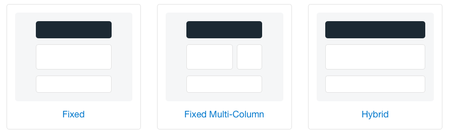
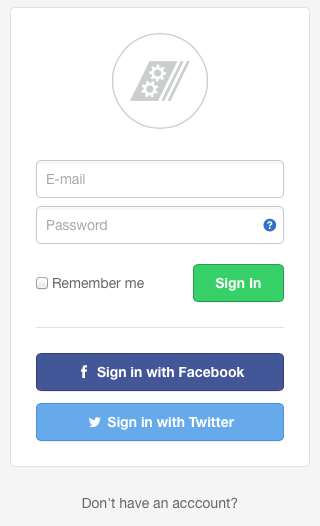

# Agile UI

**PHP library for building consistent Web User Interfaces.**

*"As a full-stack PHP developer I love writing code. But when dealing with Web Apps I am forced to also work with HTML and CSS. I wish there would be an easy-to-use UI that could just work out of the box."*  -- Anonymous Coder.

Developers rejoice!! If you use Bootstrap or Sematnic UI - why bother copy-pasting those HTML snippets from template to template? 

Agile UI brings all the core UI components to life though a simple object oriented interface that can work easily and natively inside any PHP application or framework.

## Features of Agile UI

-   Extensive library of UI elements - Grid, Form, Card, CRUD, Menu and many more.
-   Uses Semantic UI or Bootstrap CSS frameworks and fully responsive.
-   Works with any database schema, SQL or NoSQL.
-   Integration with JavaScript frameworks such as jQuery.
-   No page reloads. AJAX and Dynamic Dialogs.
-   Use your own tempalte, or create composite UI views.

## How to use Agile UI

Agile UI lets you to build apps with only the basic PHP knowledge. If you are already using a framework or an application, you can incorporate Agile UI on some of your pages. You have several choices:

-   Full page render - Agile UI will produce all of the HTML on your page
-   Layout render - Best for composite UI that would fit into your existing HTML.
-   View render - Render individual UI component (Form, Button or Menu)

The code below consists of 3 parts: Building the UI objects. Rendering. Outputting.

``` php
$cr = new \atk4\ui\CRUD();
$cr->setModel(new Client($db));

$cr->render();

// Anywhere in your code:
$html = $m->getHTML();
$js = $m->getJS();
```

 The above code will place the following interactive element on one of your pages:

The above CRUD view will be fully interractive, respond to button-clicks, reload itself, use pagination and dialogs without any additional code or mark-up.

### Data Access

Agile UI uses database access abstraction framework [Agile Data](http://git.io/ad), which is compatible with SQL and NoSQL data-sources. For the above code to work you would have to define a "Client" class and initialize database connection.

### Output

Agile Data objects produces 3 types of output:

-   HTML output - place it where you would like your UI objects to appear.
-   JavaScript output - `<script>` blocks that are needed to support the UI and initialize bindings.
-   Immediate output - provides direct output for AJAX requests, responding to user actions.

### Layouts

You can use a professional app layout, that comes with some pre-initialized objects such as Menus, Panels and toolbars:



``` php
$ui = new \atk4\ui\Layout();

$ui->menu->addItem(['Logout', 'icon'=>'exit']);

$form = new \atk\ui\Form($ui);
$form->setModel(new Order($db));

$form->onSubmit(function($form){ 
  $form->save();
});

$layout->run();
```

When you execute "run()" method, Agile UI assumes that no other HTML output will be provided and will simply output itself wrapped inside a boilerplate HTML.

## Standart UI Components and Extensions

Agile UI comes integrates with "3rd party extension" library where other developers can share "Views" that they have created. The extension library is designed to help you sit down with your client and browse through available widgets and re-use some of the code rather than re-writing those every time. 

Here is an example View for a "Login Form", sample 3rd party extension:

 

All the Views (including 3rd party ones) follow these patterns:

-   Produce correct HTML code that fits into the style of your app.
-   Fully interractive out of the box.
-   Always re-use basic elements elements (Button, Forms)
-   Will work with your database (SQL or NoSQL)
-   You tweak or replace any template, or insert more views such as extra buttons etc.

## Security and Performance

When using 3rd party code, product owners have two major concerns: performance and security.

Agile Data addresses both through the use of "[Agile Data](http://git.io/ad)" - data access framework. To further improve security, there is a special extension that will enable ACL on per-object level for your domain model data.

## Based on Agile Toolkit Concepts

Tens of thousands of developers have already used Agile Toolkit 4.3 or earlier, which today is one of the [most popular PHP UI Frameworks](https://www.google.co.uk/search?q=php+ui+framework&ie=UTF-8&oe=UTF-8&gfe_rd=cr&ei=Na7iV8mbN8GBaK7Ju7AD). Unfortunatelly the current verison of Agile Toolkit does not play well with other frameworks or applications. 

Agile UI is a refactor of the core functionality of Agile Toolkit, designed to address the following problems:

- Can be used in any framework.
- Has minimum dependencies.
- Full documentation and test-code coverage.
- Makes extensive use of Semantic UI and jQuery.
- Improved performance, memory management and security.

Once Aglie UI is finished, it will be available in "Agile Toolkit 4.4", but also as a plugin into other popular PHP platforms - Wordpress, Drupal, Magento, Laravel, Yii.

As a developer you will get the benefit of accessing unified UI library regardless of which PHP framework you are using.

## Render Tree Concept

Agile Toolkit pioneered Render View Tree concept in 2011 and it's a fundamental principle of Agile UI framework today. It allows composing one view from another creating infinite posibilities. Here is a snippet demonstrating how to add a interactive Button inside a standard CRUD View:

``` php
$b = new Button(['Hello', 'icon' => 'bell']);
$b->on('click', $b->dialog('Hello', function($page){
     $page->add(new View('hello.jade'));
     $page->add(new Button('Close'))
           ->js()->univ()->closeDialog();
}));

$cr->add($b, ['spot' => 'toolbar']);
```

 

We strive to create an extensive set of UI Views as well as educate 3rd party component developers to keep their components flexible and configurable. 

## Installation

To start using Agile UI in your project:

```
composer require atk4/ui
```

Depending on the framework/application platform that you are using, there might be an easier way to install Agile UI.

## Current Status

Agile UI is currently in the **early development stage**. Our development process is open to anyone and we welcome any curious person in our Gitter chat:

[](https://gitter.im/atk4/atk4?utm_source=badge&utm_medium=badge&utm_campaign=pr-badge&utm_content=badge) [](https://packagist.org/packages/atk4/ui)


## Roadmap

| Version | Features                                 |
| ------- | ---------------------------------------- |
| 0.1     | Bootstrap the test-suite, continious integration and UI-testing. |
| 0.2     | Implement template engine and a static "View". |
| 0.3     | Implement JavaScript mechanics, integrate RequireJS, jQuery and Semantic UI |
| 0.4     | Implement URL mechanics and reloading    |
| 0.5     | Implement standard set of UI elements - Button, Menu, Label, etc. |
| 0.6     | Implement Form                           |
| 0.7     | Implement Grid                           |
| 0.8     | Implement CRUD                           |
| 0.9     | Implement real-time code execution (for consoles, progress-bars, spinners) |