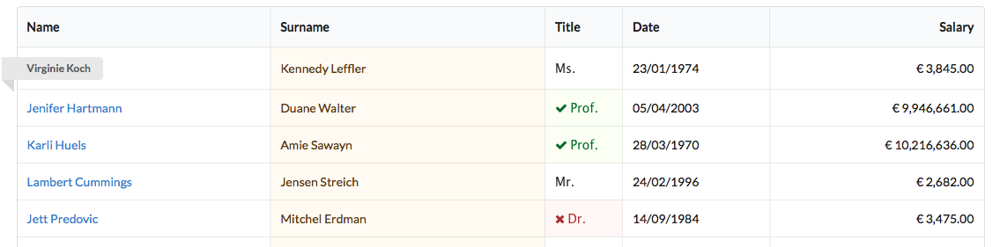

# Agile UI

[](https://travis-ci.org/atk4/ui)
[](https://codeclimate.com/github/atk4/ui)
[](https://styleci.io/repos/68417565)
[](https://codeclimate.com/github/atk4/ui/coverage)
[](https://packagist.org/packages/atk4/ui)

**Web UI Component library.**

A component (or widget) is an interactive part of your user-interface, just like this example here:



Creating a re-usable, interractive and flexible component usually takes a lot of effort and knowledge.  Howevever, with Agile UI, this can be done very easily and with just a basic PHP knowledge.

*(WARNING: Agile UI may permanently change your understanding of a phrase "reinvent the wheel")*

Components created with Agile UI are:

-   Portable. Use those components in any major PHP framework or application (including legacy apps)
-   Data-agnostic. Widgets vizualize and interract with data, that can come from SQL, NoSQL or API (See Agile Data, https://git.io/ad).
-   Composable. Your components can encapsulate other componens recursively.

## Bundled componens

Agile UI comes with many built-in components;

| Name                                     | Description                              | Introduced |
| ---------------------------------------- | ---------------------------------------- | ---------- |
| Core | Template, Render Tree and various patterns | 0.1 |
| [Button](http://ui.agiletoolkit.org/demos/button.php) | Button in various variations including icons, labels, styles and tags | 0.1        |
| [Input](http://ui.agiletoolkit.org/demos/field.php) | Decoration of input fields, integration with buttons. | 0.2        |
| [JS](http://ui.agiletoolkit.org/demos/button2.php) | Assign JS events and abstraction of PHP callbacks. | 0.2        |
| [Header](http://ui.agiletoolkit.org/demos/header.php) | Simple view for header.                  | 0.3        |
| [Menu](http://ui.agiletoolkit.org/demos/layout2.php) | Horizontal and vertical multi-dimensional menus with icons. | 0.4        |
| [Form](http://ui.agiletoolkit.org/demos/form.php) | Validation, Interactivity, Feedback, Layouts, Field types. | 0.4        |
| Layouts 1                                | Admin, Centered.                         | 0.4        |
| [Grid](http://ui.agiletoolkit.org/demos/grid.php) | Formatting, Columns, Status, Link, Template, Delete. | 0.5        |
| GridAdvanced                             | Toolbar, Paginator, Quick-search, Expander, Actions. | 1.1 *      |
| Dialog                                   | Modal dialog with dynamically loaded content. | 1.1 *      |
| Relading                                 | Dynamically re-render part of the UI.    | 1.1 *      |
| Actions                                  | Extended buttons with various interactions | 1.1 *      |
| CRUD                                     | Create, List, Edit and Delete records (based on Advanced Grid) | 1.2 *      |
| Messages                                 | Such as "Info", "Error", "Warning" or "Tip" for easy use. | 1.0        |
| Layouts 2                                | 4 Responsive: Admin, Centered, Site, Wide. | 1.2 *      |
| Breadcrumb                               | Push links to pages for navigation. Wizard. | 1.3 *      |
| Items, Cards                             | Responsive Items and Card implementaiton. | 1.4 *      |
| Wizard                                   | Multi-step, wizard with temporary data storing. | 1.5 *      |
|                                          |                                          |            |

-- * Component is not implemented yet.

All bundled components are free and licensed under MIT license. They are installed together with Agile UI.

External and 3rd party components may be subject to different licensing terms.

## Installing and Using

In your command line type `composer require atk4/ui`.

Afterwards, use this code to see a Hello World message:

``` php
require "vendor/autoload.php";

$app = new \atk4\ui\App('My First App');
$app->initLayout('Centered');

$app->layout->add('HelloWorld');
```

That's right! We have [Hello World component](https://github.com/atk4/ui/blob/develop/src/HelloWorld.php)!! When you are ready to do something bit more advanced:

``` php
require "vendor/autoload.php";

$db = new \atk4\data\Persistence_SQL('mysql:dbname=test;host=localhost','root','root');
$app = new \atk4\ui\App('My Second App');
$app->initLayout('Admin');

$m_comp = $app->layout->menu->addMenu(['Layouts', 'icon'=>'puzzle']);
$m_comp->addItem('Centered', 'centered');
$m_comp->addItem('Admin', 'admin');

$m_comp = $app->layout->menu->addMenu(['Component Demo', 'icon'=>'puzzle']);
$m_form = $m_comp->addMenu('Forms');
$m_form->addItem('Form Elements', 'from');
$m_form->addItem('Form Layouts', 'layout');
$m_comp->addItem('CRUD', 'crud');

$app->layout->leftMenu->addItem(['Home', 'icon'=>'home']);
$app->layout->leftMenu->addItem(['Topics', 'icon'=>'block layout']);
$app->layout->leftMenu->addItem(['Friends', 'icon'=>'smile']);
$app->layout->leftMenu->addItem(['Historty', 'icon'=>'calendar']);
$app->layout->leftMenu->addItem(['Settings', 'icon'=>'cogs']);

$f = $app->layout->add(new \atk4\ui\Form(['segment']));

$f_group = $f->addGroup('Name');
$f_group->addField('first_name', ['width'=>'eight']);
$f_group->addField('middle_name', ['width'=>'three']);
$f_group->addField('last_name', ['width'=>'five']);

$f_group = $f->addGroup('Address');
$f_group->addField('address', ['width'=>'twelve']);
$f_group->addField('zip', ['Post Code', 'width'=>'four']);

$f->onSubmit(function ($f) {
    $errors = [];

    foreach (['first_name', 'last_name', 'address'] as $field) {
        if (!$f->model[$field]) {
            $errors[] = $f->error($field, 'Field '.$field.' is mandatory');
        }
    }

    return $errors ?: $f->success('No more errors', 'so we have saved everything into the database');
});
```

For more examples simply look into [demo folder](https://github.com/atk4/ui/tree/develop/demos).

### Single component render

If you need to render only one component without boilerplate HTML, use render() method.

``` html
 <head>
    <link rel="stylesheet" type="text/css" href="http://semantic-ui.com/dist/semantic.css">
    <script src="https://code.jquery.com/jquery-3.1.1.js"></script>
    <script src="http://semantic-ui.com/dist/semantic.js"></script>
</head>
<body>
  
<?php 
  $component = new \atk4\ui\HelloWorld();
  echo $component->render();
?>
 
</body>
```

## Documentation

Because Agile UI makes active use of Agile Core and Agile data, I'm linking all related documentation here:

-   [Agile UI Documentation](http://agile-ui.readthedocs.io)
-   [Agile Data Documentation](http://agile-data.readthedocs.io)
-   [Agile Core Documentation](http://agile-core.readthedocs.io)

If anything is unclear or you want to get in touch with other awesome people who use Agile UI:

-   [Forum](https://forum.agiletoolkit.org) - use label Agile UI or Agile Data.
-   [Developer Gitter Live Chat](https://gitter.im/atk4/atk4) - if you wish to say Thanks to those who created Agile UI (for free!)

 ## Scope and Goals of Agile UI

What makes this UI toolkit stand out from the others UI libraries is a commitment to bring rich and interractive web components that can be used for 90% of web applications without any custom-HTML/JS. Additionally, Agile UI provides a very controlled and consistent ways to develop "add-ons" that include visual components and other re-usable elements.

To achieve its goal, Agile UI offers both the tools for creating components and a wide selection of built-in components that provides the "minimum standard Web UI":


Agile UI follows 'best development practices' and looks to create an eco-system of 3rd party "UI components" that follow the Web UI standard solving issues such as:

- Incompatible HTML code produced by and excessive CSS/JS assets
- Differences in UI styles between your main theme and add-on UI
- Extensibility standard of all UI components based on principles of Dependency Injection, Template Injection and Inheritance
- Full control over JavaScript events and integration with jQuery and its plugins
- Controlled access between UI componets and domain model data with persistence abstraction
- **And most importantly: a responsive and modern interface based on Semantic UI CSS**

## Q&A

**Q: HTML-generating frameworks are lame and inefficient, real coders prefer to manually write HTML/CSS in Twig or Smarty.**

Agile UI was created for those who are in a hurry and not immediately concerned about the shades of their UI buttons. We have created a solid looking UI and diverse set of components that, like all applications, can be adapted and released with any UI.

Our goal was to create an out-of-the-box UI which you can "use", not "reinvent". 

**Q: What about Angular-JS, VueJS and all the other JS frameworks?**

We went with the default pattern that allows you to write the entire application in ONE language: PHP.

However, the "component" in Agile UI does not conflict if you choose to use a different  JavaScript framework. We found that **jQuery** and its plug-ins are most suitable for our design patterns. However, you can build a highly interractive component that relies on a different JavaScript frameworks or principles.

**Q: I used "X" component framework and found it extremely limiting.**

In the past, many UI / Component frameworks have been unable to find a good balance between flexiblity and convenience. Some out-of-the-box CRUD systems are too generic while other Form-builders are just too overengineered and unattractive.

Agile UI follows these core principles in it's design:

-   Instead of focusing on generic HTML, create HTML for a specific CSS framework (Semantic UI)
-   Allow developers to use all the features of CSS framework without leaving PHP
-   No custom proprietary JS code. Keep all the HTML simple
-   Allow developers to customise or extend components
-   Keep Agile UI as a open-source project under MIT license

Following those principles gives us the perfect combination of flexibility, elegance and performance.

**Q: I prefer Bootstrap CSS (or other CSS) over Semantic UI**

We considered several CSS frameworks.  We decided to focus on Semantic UI implementation as our primary framework for the following reasons:

-   Great theming and customisation variables
-   Clear patterns in class definitions
-   Extensive selection of core components
-   jQuery and JavaScript API integrations

Bearing in mind the popularity of Bootstrap CSS, we are working towards an extension that will allow you to switch your entire UI between Semantic UI and Bootstrap in the future.

## List of core Features in Agile UI

While many UI toolkits focus on giving you ready-to-use advance components, we produced a foundation of basic ones as building blocks then create more advanced components that are easily integrated.

1.  Rendering HTML - Agile UI is about initializing UI objects then rendering them. Each component is driven by the UI logic and all play a vital part in the Render Tree.
2.  Templates - We know that as developer you want control. We offer the ability to create custom templates for custom Views to improve performance and memory usage.
3.  Composite Views - This allows View object to implement itself by relying on other Views.
4.  JavaScript actions - This technique is designed to bind PHP Views with generic JavaScript routines and also to eliminate the need for you to write custom JavaScript code (e.g. `('#myid').dropdown();`).
5.  JavaScript events - JS actions can be asigned to events. For instance, you can instruct a "Button" object to refresh your "Grid" object in a single line of PHP.
6.  Buttons, Fields, Dropdown, Boxes, Panels, Icons, Messages - All those basic Views can be used 'out-of-the-box' and are utilising principles described above to remain flexible and configurable.
7.  Callbacks - A concept where a client-side component's rendering can execute an AJAX request to its PHP code triggering a server-side event. Agile UI ensures full isolation and robustness with this approach.
8.  Agile Data - Integration with data and business logic framework allows you to structure your growing PHP application's business logic properly and conforming to best practices of web development.
9.  Form - Culmination of concepts "callbacks", "composite views" and reliance on a dozen basic views creates a very simple way to create a modern and flexible Form implementation. Capable of rendering, submitting it's own data back, handling errors and server-side validation just in a few lines of PHP code - Form is the most elegant "Form Builder" you will find for PHP.
10.  Grid and Lister - An interractive and extensible UI component for outputing your data as a table or as a formatted list. When you have a lot of records to render, those components will prove to be very performance efficient.
11.  Dialogs - Introduces ability for you to use pop-ups and JavaScript dialog frame to reveal underlying UI.
12.  CRUD - A composite view that combines Form, Dialogs and Grids to create a fully interractive interface for managing your Model Entity data. Extensible and compatible with various add-ons, you will find CRUD to be a most efficient way to build your Admin system.
13.  Layouts, Menus, Pages, Tabs, Accordion - Several objects to create a bigger picture and link together the entire UI of your application.
14.  Application - This is an abstract interface that can be implemented using your full-stack framework of choice. The "App" class is built for stand-alone applications.  For any other framework, a custom application class can be provided to make the entire UI section adjust accordingly.


[](https://gitter.im/atk4/atk4?utm_source=badge&utm_medium=badge&utm_campaign=pr-badge&utm_content=badge)
