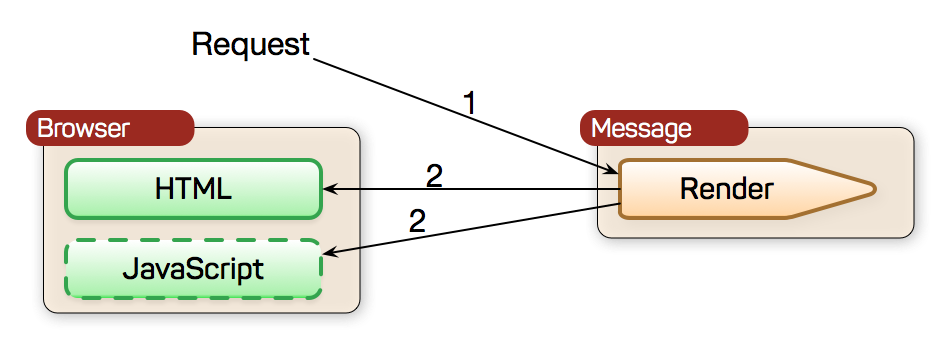
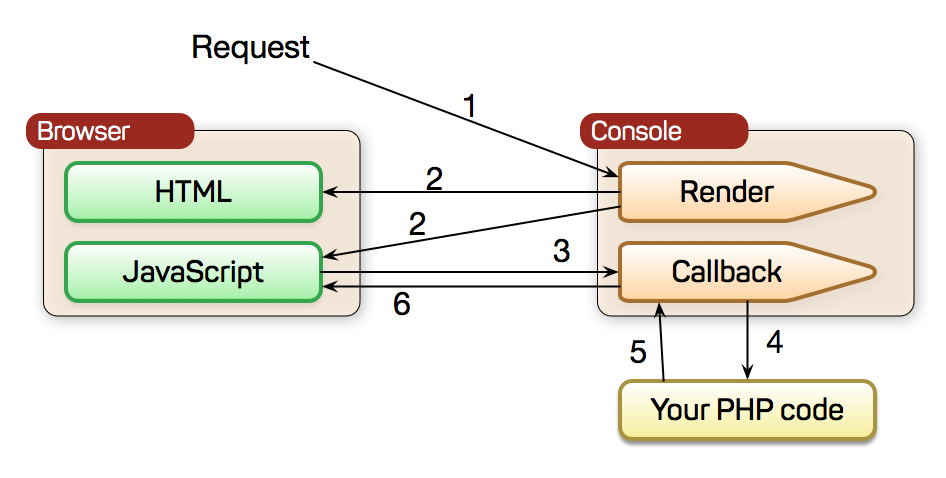
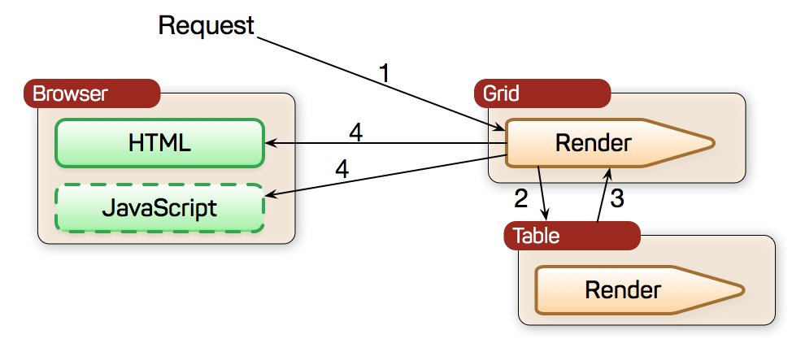

==========
Components
==========

Classes that extend from :php:class:`View` are called `Components` and inherit abilities to render themselves (see :ref:`render`)

Core Components
===============

Some components serve as a foundation of entire set of other components. A lot of qualities implemented by a core component is
inherited by its descendants.

.. toctree::
    :maxdepth: 1

    view
    lister
    table
    field

Simple components
=================

Simple components exist for the purpose of abstraction and creating a decent interface which you can rely on when programming your
PHP application with Agile UI. In some cases it may make sense to rely on HTML templates for the simple elements such as Icons,
but when you are working with dynamic and generic components quite often you need to abstract HTML yet let the user have decent
control over even the small elements.

.. toctree::
    :maxdepth: 1

    button
    label
    text
    loremipsum
    header
    icon
    image
    message
    tabs
    wizard
    helloworld

Interactive components
=======================

Interactive components rely on :ref:`callback`, :ref:`virtualpage` or :ref:`sse` to communicate with themselves in the PHP realm. You add them
just as you would add any other component, yet they will send additional requests, like loading additional data or executing
other code. Here is how interractive components will typically communicate:

1. request by browser is made. 
2. :php:class:`App` asks :php:class:`Console` to render HTML+JavaScript. 
3. JavaScript invokes AJAX request using a :php:class:`Callback` URL. 
4. Callback invokes user-defined PHP code, which will generate some :php:meth:`Console::output()`.
5. Response is encoded and 
6. sent back to the browser either as JSON or :ref:`sse`.

.. toctree::
    :maxdepth: 1

    console
    loader
    progressbar
    wizard

Composite components
====================

Composite elements such as Grid are the bread-and-butter of Agile UI. They will pass on rendering and
intractivity to several sub-components. Illustration shows how :php:class:`Grid` relies on :php:class:`Table` for
rendering the data table, but Grid will also rely on :php:class:`Menu` and :php:class:`Paginator` when necessary.

Any component automatically becomes composite if, you use :php:meth:`View::add()`.

.. toctree::
    :maxdepth: 1

    columns
    crud
    grid
    form
    paginator
    dropdown

    misc
