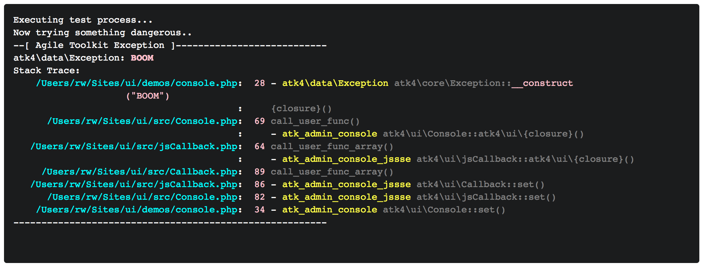

.. php:namespace:: atk4\ui

.. php:class:: Console

=======
Console
=======

With console you can output real-time information to the user directly from PHP. It can
be used do direct output from slow method or even execute commands on the server (such as `ping`).

Demo: https://ui.agiletoolkit.org/demos/console.php

Basic Usage
===========

.. php:method:: set($callback)

.. php:method:: send($callback)

After adding a console to your :ref:`render_tree`, you just need to set a call-back::

    $console = $app->add('Console');
    $console->set(function($console) {

        // This will be executed through SSE request

        $console->output('hello');

        echo 'world'; // also will be redirected to console

        sleep(2);

        $console->send(new \atk4\ui\jsExpression('alert([])', ['The wait is over']));
    });

Console uses :ref:`sse` which works pretty much out-of-the-box with the modern browsers and unlike websockets
do not require you to set up additional ports on the server. JavaScript in a browser captures real-time
events and displays it on a black background.

Console integrates nicely with DebugTrait (https://agile-core.readthedocs.io/en/develop/debug.html?highlight=debug),
and also allows you to execute shell process on the server while redirecting output in real-time.

Using With Object
=================

.. php:method:: runMethod($callback);

We recommend that you pack up your busineess logic into your Model methods. When it's time to call your method,
you could either do this::

    $user->generateReport(30);

Which would execute your own routine for some report generation, but doing it though a normal request will look like
your site is slow and is unable to load page quick. Alternative is to run it through a console::

    $console->runMethod($user, 'generateReport', [30]);

This will display console to the user and will even output information from inside the model::

    use \atk4\core\DebugTrait();

    function generateReport($pages) {
        $this->info('converting report to PDF');

        // slow stuff
        $this->info('almost done, be patient..');

        // more slow stuff
        return true;
    }

You can also execute static methods::

    $console->runMethod('StaticLib', 'myStaticMethod');

Executing Commands
==================

.. php:method:: exec($cmd, $args);

.. php:argument:: last_exit_code

To execute a command, use::

    $console->exec('/sbin/ping', ['-c', '5', '-i', '1', '192.168.0.1']);

This will run a command, and will stream command output to you. Console is implemented to capture both STDOUT and STDERR in
real-time then display it on the console using color. Console does not support ANSI output.

Method exec can be executed directly on the $console or inside the callback::

    $console->set(function($console){

        $console->eval();

    });

Without call-back, eval will wrap itself into a callback but you can only execute a single command. When using callback
form, you can execute multiple commands::

    $app->add('Console')->set(function($c){
        $c
            ->exec('/sbin/ping', ['-c', '5', '-i', '1', '192.168.0.1'])
            ->exec('/sbin/ping', ['-c', '5', '-i', '2', '8.8.8.8'])
            ->exec('/bin/no-such-command')
            ;
    });

Method exec() will return `$this` if command was run inside callback and was successful. It will return `false` on error
and will return `null` if called outside of callback. You may also refer to ::php:attr:`Console::last_exit_code` which
contains exit code of the last command.

Normally it's safe to chain `exec` which ensures that execution will stack. Should any command fail, the subsequent
`exec` won't be performed.

NOTE that for each invocation `exec` will spawn a new process, but if you want to execute multiple processes, you
can wrap them into `bash -c`::

    $app->add('Console')->exec('bash', [
        '-c',
        'cd ..; echo "Running \'composer update\' in `pwd`"; composer --no-ansi update; echo "Self-updated. OK to refresh now!"'
    ]);

This also demonstrates argument escaping.
