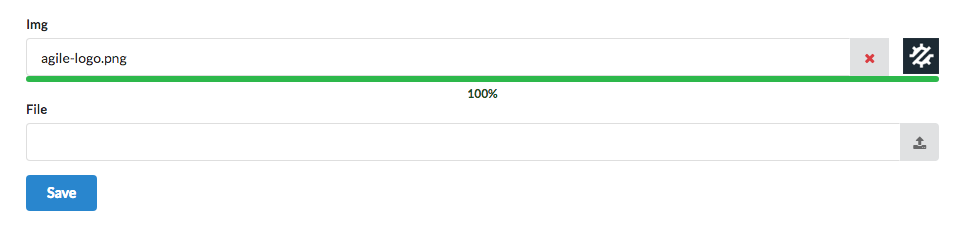

===========
File Upload
===========

Upload (and UploadImg) classes implement Form Field that can be used to upload files or images.
Implementation of :php:class:`Form` in Agile UI submits data using JavaScript request and
therefore files should be uploaded before form submission. Process used can be described
in steps:

 1. User arrives at the page with a form
 2. User selects file.
 3. File begins uploading.
 4. PHP upload callback :php:meth:`Upload::onUpload` is called, returns "file_id"
 5. "file_id" is placed inside form.
 6. User submits the form
 7. :php:meth:`\atk4\ui\Form::onSubmit()` receives "file_id"

Currently only one file can be uploaded at a time. If file is uploaded incorrectly,
it can be removed. Both Upload and UploadImg fields contain an upload button which would
open a File Selection dialog. UploadImg also implements image preview icon.
During upload, a progress bar will appear.

.. php:namespace:: atk4\ui\FormField

.. php:class:: Upload

Attributes
==========

Upload field has the following properties:

.. php:attr:: accept

An array of string containing the file type accept by the field, default is empty.
Example would be: `['application/pdf', 'images/*']`.

.. php:attr:: hasFocusEnable

Whether file open dialog will show by clicking the input field, default to true.

.. php:attr:: action

The button view to use for displaying the file open dialog. A default action button is used if omitted.

Callbacks
=========

When adding an Upload or UploadImg field to a form, onUpload and onDelete callback must be defined::

    $img = $form->addField('img', ['UploadImg', ['defaultSrc' => './images/default.png', 'placeholder' => 'Click to add an image.']]);

    $img->onUpload(function ($files) {
        //callback action here...
    });

    $img->onDelete(function ($fileId) {
        //callback action here...
    });

onUpload
--------

The onUpload callback get called as soon as the upload process is finished. This callback
function will receive the `$_FILES['upfile']` array as function parameter (see https://php.net/manual/en/features.file-upload.php),
or '$error' string if there was problem during upload.

The onUpload callback function is a good place to:

- ensure the file is of a proper type and safe,
- move file to a proper location on server or in a cloud,
- save file property in db,
- setup a fileId that will used on a form form save,
- setup a file preview to display back to user,
- notify your user of the file upload process,

Example showing the onUpload callback on the UploadImg field::

    $img->onUpload(function ($files) use ($form, $img) {
        if ($files === 'error') {
            return $form->error('img', 'Error uploading image.');
        }

        //Do file processing here...

        $img->setThumbnailSrc('./images/'.$file_name);
        $img->setFileId('123456');

        // can also return a notifier.
        return new atk4\ui\jsNotify(['content' => 'File is uploaded!', 'color' => 'green']);
    });

When user submit the form, the field data value that will be submitted is the fileId set during the onUpload callback.
The fileId is set to file name by default if omitted::

    $form->onSubmit(function ($form) {
        // implement submission here
        return $form->success('Thanks for submitting file: '.$form->model['img']);
    });

onDelete
--------

The onDelete callback get called when user click the delete button. This callback function
receive the same fileId set during the onUpload callback as function parameter.

The onDelete callback function is a good place to:

- validate ID (as it can technically be chenged through browser's inspector)
- load file property from db
- remove previously uploaded file from server or cloud,
- delete db entry according to the fileId,
- reset thumbnail preview,

Example showing the onDelete callback on the UploadImg field::

    $img->onDelete(function ($fileId) use ($img) {
        //reset thumbanil
        $img->clearThumbnail('./images/default.png');

        return new atk4\ui\jsNotify(['content' => $fileId.' has been removed!', 'color' => 'green']);
    });

UploadImg
=========

Similar to Upload, this is a field implementation for uploading images. Here are additional properties:

.. php:class:: UploadImg

UploadImg field inherits all of the Upload properties plus these ones:

.. php:attr:: thumbnail

The thumbnail view associate with the field.

.. php:attr:: thumnailRegion

The region in input template where to add the thumbnail view, default to AfterAfterInput region.

.. php:attr:: defaultSrc

The default image source to display to user, prior to uploading the images.
