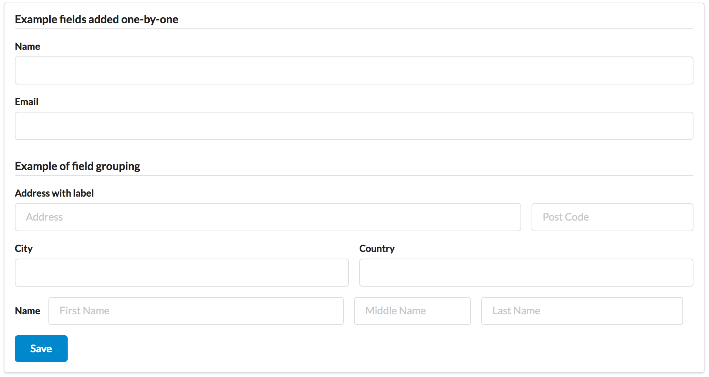

.. _form:

=====
Forms
=====

.. php:namespace:: atk4\ui

.. php:class:: Form

One of the most important components of Agile UI is the "Form" - a View:

Features of a Form include:

 - Rendering a beautiful and valid form:
    - wide range of supported field types
    - field grouping (more than one field per line)
    - define field width, positioning and size
    - labels, placeholders and hints
    - supports automated layouts or you can define a custom one

 - Integration with Model objects:
    - automatically populate all or specific fields
    - handle multi-field validation
    - use of semi-automated layouting (you can arrange group of fields)
    - respect caption and other ui-related settings defined in a model
    - lookup referenced models for data
    - data types are converted automatically (e.g. date, time, boolean)

 - JavaScript integration
    - form is submitted using JavaScript
    - during submit, the loading indicator is shown
    - javascript sends data through POST
    - POST data is automatically parsed and imported into Model

 - You may define onSubmit PHP handler that:
    - can handle more validation
    - make advanced decisions before saving data
    - perform a different Actions, such as reload parts of page or close dialog.
    - save data into multiple models
    - indicate successful completion of a form through a nicely formatted message
    - anything else really!

Creating Basic Forms
---------------------

To create a form you need the following code::

    $form = new \atk4\ui\Form();
    $form->addField('email');

    $app->layout->add($form);

The first line creates a "Form" object that is assigned to variable `$f`. Next
line defines a new field that is placed inside a form. Once form is defined, it
needs to be placed somewhere in a Render Tree, so that the users can see it.

If $form is not yet associated with a model (like above) then an empty model will
be created. If you are not using the model, you will need to define
:php:meth:`onSubmit()` handler. (Your other option is to use :php:meth:`setModel()`.

Adding Fields to a form
^^^^^^^^^^^^^^^^^^^^^^^

.. php:method:: addField(data_field, form_field = null)

Create a new field on a form. The first argument is a data field definition.
This can simply be a string "email". Additionally you can specify an array or
even a instance of 
`\atk4\data\Field <http://agile-data.readthedocs.io/en/develop/fields.html>`_

If form is associated with a model, and the specified field exists, then 
Data Field object will be looked up. Data Field defines type, caption, possible
values and other information about the data itself.

Second argument can be used to describe area around the field, which is a visual
object derived from :php:class:`Form::Field`. The class usually is guessed
from the data field type, but you can specify your own object here. Alternatively
you can pass array which will be used as defaults when creating appropriate
Form Field.

Here are some of the examples::

    // Data field type decides form field class
    $form->addField(['is_accept_terms', 'type'=>'boolean']); 

    // Specifying enum makes form use drop-down
    $form->addField(['agree', 'enum'=>['Yes', 'No']]);

    // We can switch to use Radio selection
    $form->addField(['agree', 'enum'=>['Yes', 'No']], new \atk4\ui\FormField\Radio());

.. important:: Always use `'type'=>` because this also takes care of
    `type-casting <http://agile-data.readthedocs.io/en/develop/typecasting.html>`_
    e.g. converting data formats.

Integrating Form with a Model
^^^^^^^^^^^^^^^^^^^^^^^^^^^^^

As you work on your application, in most cases you will be linknig Form with 
`Model <http://agile-data.readthedocs.io/en/develop/model.html>`. This is much
more convenient and takes care of handling data flow all the way from the user
input to storing them in the database.

.. php:method:: setModel($model, [$fields])

    Associate field with existing model object and import all editable fields
    in the order in which they were defined inside model's init() method.

    You can specify which fields to import and their order by simply listing
    field names through second argument.

    Specifying "false" or empty array as a second argument will import no fields.

.. php:attr:: model

    Model that is currently associated with a Form.

For the next demo, lets actually define a model `Person`::

    class Person extends \atk4\data\Model
    {
        public $table = 'person';

        public function init()
        {
            parent::init();
            $this->addField('name', ['required'=>true]);
            $this->addField('surname');
            $this->addField('gender', ['enum' => ['M', 'F']]);
        }

        public function validate()
        {
            $errors = parent::validate();

            if ($this['name'] == $this['surname']) {
                $errors['surname'] = 'Your surname cannot be same as the name';
            }

            return $errors;
        }
    }

We can now populate form fields based around the data fields defined in the model::

    $app->layout->add('Form')
        ->setModel(new Person($db));

This should display a following form:

    $form->addField(
        'terms',
        ['type'=>'boolean', 'ui'=>['caption'=>'Accept Terms and Conditions']]
    );

Form Submit Handling
--------------------

.. php:method:: onSubmit($callback)

    Specify a PHP call-back that will be executed on successful form submission.

.. php:method:: error($field, $message)

    Create and return :php:class:`jsChain` action that will indicate error on a field.

.. php:method:: success($title, [$sub_title])

    Create and return :php:class:`jsChain` action, that will replace form with a success message.

.. php:attr:: successTemplate

    Name of the template which will be used to render success message.

To continue with my example, I'd like to add new Person record into the database
but only if they have also accepted terms and conditions. I can define onSubmit handler
that would perform the check, display error or success message::

    $form->onSubmit(function($form) {
        if (!$form->model['terms']) {
            return $form->error('terms', 'You must accept terms and conditions');
        }

        $form->model->save();

        return $form->success('Registration Successful', 'We will call you soon.');
    });

Callback function can return one or multiple JavaScript actions. Methods such as
:php:meth:`error()` or :php:meth:`success()` will help initialize those actions for your form. Here is a code
that can be used to output multiple errors at once. I intentionally didn't want to group
errors with a message about terms and conditions::

    $form->onSubmit(function($form) {
        $errors = [];

        if (!$form->model['name']) {
            $errors[] = $form->error('name', 'Name must be specified');
        }

        if (!$form->model['surname']) {
            $errors[] = $form->error('surname', 'Surname must be specified');
        }

        if ($errors) {
            return $errors;
        }

        if (!$form->model['terms']) {
            return $form->error('terms', 'You must accept terms and conditions');
        }

        $form->model->save();

        return $form->success('Registration Successful', 'We will call you soon.');
    });

At the time of writing, Agile UI / Agile Data does not come with a validation library, but
you can use any 3rd party validation code.

Callback function may raise exception. If Exception is based on ``\atk4\core\Exception``,
then the parameter "field" can be used to associate error with specific field::

    throw new \atk4\core\Exception(['Sample Exception', 'field'=>'surname']);

If 'field' parameter is not set or any other exception is generated, then error will not be
associated with a field. Only the main Exception message will be delivered to the user.
Core Exceptions may contain some sensitive information in parameters or back-trace, but those
will not be included in response for security reasons.

Form Layout
-----------

When you create a Form object and start adding fields through either :php:meth:`addField()` or
:php:meth:`setModel()`, they will appear one under each-other. This arrangement of fields as
well as display of labels and structure around the fields themselves is not done by a form,
but another object - "Form Layout". This object is responsible for the field flow, presence
of labels etc.

.. php:method:: setLayout(FormLayout\Generic $layout)

    Sets a custom FormLayout object for a form. If not specified then form will automatically
    use FormLayout\Generic.

.. php:attr:: layout

    Current form layout object.

.. php:method:: addHeader($header)

    Adds a form header with a text label. Returns View.

.. php:method:: addGroup($header)

    Creates a sub-layout, returning new instance of a :php:class:`FormLayout\Generic` object. You
    can also specify a header.

.. php:class:: FormLayout\Generic

    Renders HTML outline encasing form fields.

.. php:attr:: form

    Form layout objects are always associated with a Form object.

.. php:method:: addField()

    Same as :php:class:`Form::addField()` but will place a field inside this specific layout
    or sub-layout.

My next example will add multiple fields on the same line::

    $form->setModel(new User($db), false);  // will not populate any fields automatically

    $form->addFields(['name', 'surname']);

    $gr = $form->addGroup('Address');
    $gr->addFields(['address', 'city', 'country']); // grouped fields, will appear on the same line

By default grouped fields will appear with fixed width. To distribute space you can either specify
proportions manually::

    $gr = $f->addGroup('Address');
    $gr->addField('address', ['width'=>'twelve']);
    $gr->addField('code', ['Post Code', 'width'=>'four']);

or you can divide space equally between fields. I am also omitting header for this group::

    $gr = $f->addGroup(['n'=>'two']);
    $gr->addFields(['city', 'country']);

You can also use in-line form groups. Fields in such a group will display header on the left and
the error messages appearing on the right from the field::

    $gr = $f->addGroup(['Name', 'inline'=>true]);
    $gr->addField('first_name', ['width'=>'eight']);
    $gr->addField('middle_name', ['width'=>'three', 'disabled'=>true]);
    $gr->addField('last_name', ['width'=>'five']);

Semantic UI modifiers
---------------------

There are many other classes Semantic UI allow you to use on a form. The next code will produce
form inside a segment (outline) and will make fields appear smaller::

    $f = new \atk4\ui\Form(['small segment']));

For further styling see documentation on :php:class:`View`.
