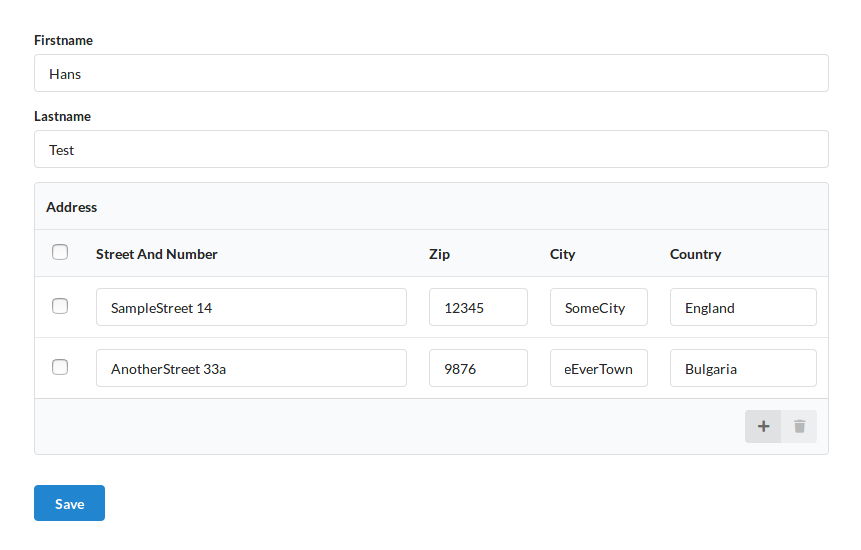
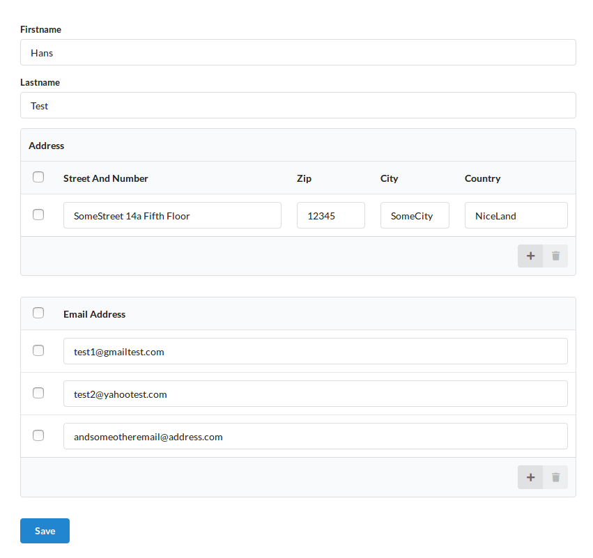

.. php:namespace:: atk4\ui\FormField

.. php:class:: MultiLine

=====
Multiline Form Field
=====

The Multiline Form Field is not a single field, but is used to edit several Model records.
A good example is a user who can have many addresses. In this example, the Model `User` containsMany `Addresses`.
This means that the addresses are not stored into a separate database table but into the field `addresses` of user table::

    /**
     * User model
     */
    class User extends \atk4\data\Model
    {
        public $table = 'user';

        public function init()
        {
            parent:: init();

            $this->addField('firstname', ['type' => 'string']);
            $this->addField('lastname', ['type' => 'string']);

            $this->containsMany('addresses', [Address::class, 'system' => false]);
            //$this->hasMany('Email', [Email::class]);
        }
    }

    /**
     * Address Model
     */
    class Address extends \atk4\data\Model
    {
        public $table = 'addresses';

        public function init()
        {
            parent::init();

            $this->addField('street_and_number', ['type' => 'string']);
            $this->addField('zip', ['type' => 'string']);
            $this->addField('city', ['type' => 'string']);
            $this->addField('country', ['type' => 'string']);
        }
    }

    //Create some sample record of user Model
    $user_data = [];
    $user = new User(new \atk4\data\Persistence\Array_($user_data));
    $user->set('firstname', 'Hans');
    $user->set('lastname', 'Test');
    $user->save();

    //Add a Form to the UI and set User as Model
    $user_form = $app->add('Form');
    $user_form->setModel($user);

This leads to a Multiline component automatically rendered for adding, editing and deleting Addresses of the user:

You can also check LINK_TO_DEMO/multiline.php for this example

Manually setting up Multiline
=============================

Multiline FormField is used by default if a Model `containsMany()` or `containsOne()` other Model, but you can set up the multiline component manually. For example, if you wish to edit
a `hasMany()` relation of a Model along with the Model itself. (In contrary to containsMany(), the records of the related Model are stored in a separate table). Lets say a User can have many email addresses,
but you want to store them in a separate table. Uncomment the line `//$this->hasMany('Email', [Email::class]);` in User Model to use it::

    /**
     * Email Model
     */
    class Email extends \atk4\data\Model
    {
        public $table = 'email';

        public function init()
        {
            parent::init();

            $this->addField('email_address', ['type' => 'string']);

            $this->hasOne('user_id', [User::class]);
        }
    }

Now when we use a Form for User records, it won't automatically add a Multiline to edit the email addresses.
If you want to edit them along with the user, Multiline is set up in a few lines::

    //Create some sample record of user Model
    $user_data = [];
    $user = new User(new \atk4\data\Persistence\Array_($user_data));
    $user->id = 1;
    $user->set('firstname', 'Hans');
    $user->set('lastname', 'Test');
    $user->save();

    //Add a form to UI to edit User record
    $user_form = $app->add('Form');
    $user_form->setModel($user);
    $ml = $user_form->addField('email_addresses', ['MultiLine']);
    $ml->setModel($user->ref('Email'));

    //set up saving of Email on Form submit
    $user_form->onSubmit(function($form) use ($ml) {
        $form->model->save();
        $ml->saveRows();
        //show saved data for testing purposes
        return new jsToast(var_export($ml->model->export(), true));
    });

Now, there is another MultiLine FormField to add, edit or delete the users email addresses:

Multiline and Expressions
=========================
If a Model has Expressions, they automatically get updated when a field value is changed. A loading icon on the ``+`` sign indicates that the expression values are updated.
Lets use the example of demos/multiline.php::

    class InventoryItem extends \atk4\data\Model
    {
        public function init()
        {
            parent::init();
            $this->addField('item', ['required' => true, 'default' => 'item']);
            $this->addField('qty', ['type' => 'number', 'caption' => 'Qty / Box', 'required' => true, 'ui' => ['multiline' => ['width' => 2]]]);
            $this->addField('box', ['type' => 'number', 'caption' => '# of Boxes', 'required' => true, 'ui' => ['multiline' => ['width' => 2]]]);
            $this->addExpression('total', ['expr' => function ($row) {
                return $row['qty'] * $row['box'];
            }, 'type' => 'number']);
        }
    }
    
The 'total' expression will get updated on each field change automatically when InventoryItem is set as model to Multiline.

Manually adding actions on a field value change
===============================================
If you want to define a callback which gets executed if a field value is changed, you can do so using the ``onLineChange()`` method. The first parameter is the callback, the second one an array including the field names which trigger the callback when changed. You can return a single jsExpressionable or an array of jsExpressionables which then will be sent to the browser. In this case we display a Toast with some message::

    $multiline->onLineChange(function ($rows, $form) {
        $total = 0;
        foreach ($rows as $row => $cols) {
            $qty = array_column($cols, 'qty')[0];
            $box = array_column($cols, 'box')[0];
            $total = $total + ($qty * $box);
        }
        return new jsToast('The new Total is '.number_format($total, 2));
    }, ['field1', 'field2']);

Changing appearance of Multiline
================================

Header
------
- The header uses the field's caption by default. 
- You can edit it by setting the ``header`` property. 
- If you want to hide the header, set the ``$header`` property to an empty string ``''``.

Changing how fields are displayed
---------------------------------
If you want to change how single inputs are displayed in the multiline, you can use field's ui property::

    $model->addFields([
        ['name', 'type' => 'string', 'ui' => ['multiline' => ['input', ['icon' => 'user', 'type' => 'text']]]],
        ['value', 'type' => 'string', 'ui' => ['multiline' => ['input', ['type' => 'number']]]],
        ['description', 'type' => 'string', 'ui' => ['multiline' => ['textarea']]],
    ]);
    
This above will display a name, value and description field within a multiline form field. The value field input will use the html attribute type set to number and the
description field will be display as a textarea input.

The `$ui['multiline']` property can be set using an array. The first element of the array is the field type to render as html in multiline form field and should contains a string value. The supported field type are input, textarea, dropdown or checkbox.
The second element of the array represent the options associated with the field type and should contains an array.
Since Multiline form field used some of Semantic-ui Vue component to render the field type in html, the options accepted
are based on Semantic-ui vue supported property. For example, input field type, or component in Semantic-ui Vue can have it's html type attribute set using the type option, like the value field set above.

You may see each option you can use by looking at Semantic-ui vue component property:
- `input <https://semantic-ui-vue.github.io/#/elements/input>`_
- `dropdown <https://semantic-ui-vue.github.io/#/modules/dropdown>`_
- `checkbox <https://semantic-ui-vue.github.io/#/modules/checkbox>`_

Note: There is no option available for textarea.

Footer
------
You can add a footer to Multiline FormField by adding a sublayout to it. In this example, we add a footer containing a read-only input which could get the value from ``onLineChange`` callback (see above)::
   
    $ml = $form->addField('ml', ['MultiLine', 'options' => ['color' => 'blue']]);
    $ml->setModel($inventory);
    // Add sublayout with total field.
    $sub_layout = $f->layout->addSublayout('Columns');
    $sub_layout->addColumn(12);
    $c = $sub_layout->addColumn(4);
    $f_total = $c->addField('total', ['readonly' => true])->set($total);
