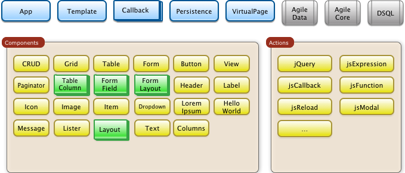
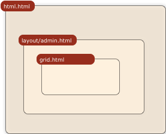
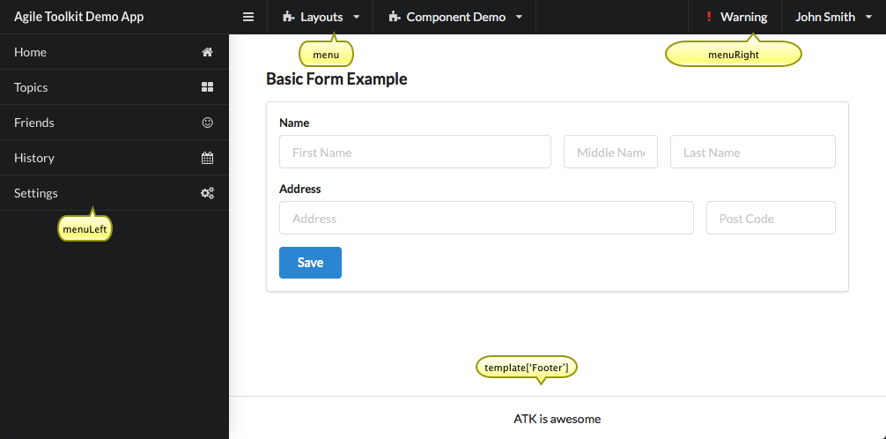
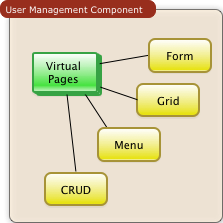

.. _overview:

====================
Overview of Agile UI
====================

Agile UI is a PHP component framework for building User Interfaces entirely in PHP.
Although the components of Agile UI will typically use HTML, JavaScript, jQuery and
CSS, the goal of Agile UI is to abstract them away behind easy-to-use component objects.

As a framework it's closely coupled with Agile Data (https://agile-data.readthedocs.io)
which abstracts database interaction operations. The default UI template set
uses Fomantic UI (https://fomantic-ui.com) for presentation.

At a glance, Agile UI consists of the following:

Agile UI is designed and built for the Agile Toolkit (https://agiletoolkit.org/) platform,
with the goal of providing a user-friendly experience when creating data-heavy API / UI
backends.

Agile UI Design Goals
=====================

Our goal is to offer a free UI framework which can be used to easily develop the most complex
business application UI in just a few hours, without diving deep into HTML/JS specifics.

1. Out of the box experience
----------------------------

Sample scenario:

    If during the .COM boom you purchased 1000 good-looking .COM domains and are now selling
    them, you will need to track offers from buyers. You could use Excel, but what if your
    staff needs to access the data, or you need to implement business operations such
    as accepting offers?

Agile UI is ideal for such a scenario. By simply describing your data model, relations,
and operations you will get a fully working UI and API with minimal setup.

2. Compact and easy to integrate
--------------------------------

Simple scenario:

    Your domains such as "happy.com" receive a lot of offers, so you want to place
    a special form for potential buyers to fill out. To weed out spammers, you want
    to perform an address verification for filled-in data.

Agile UI contains a Form component which you can integrate into your existing app.
More importantly, it can securely access your offer database.

3. Compatible with RestAPI
--------------------------

Simple scenario:

    You need a basic mobile app to check recent offers from your mobile phone.

You can set up an API end-point for authorized access to your offer database, that
follows the same business rules and has access to the same operations.

4. Deploy and Scale
-------------------

Simple scenario:

    You want to use serverless architecture where a 3rd party company is looking
    after your server, database, and security; you simply provide your app.

Agile UI is designed and optimized for quick deployment into modern serverless
architecture providers such as: Heroku, Docker, or even AWS Lambdas.

Agile UI / PHP application has a minimum "start-up" time, has the best CPU usage,
and gives you the highest efficiency and best scaling.  

5. High-level Solution
----------------------

Simple scenario:

    You are a busy person who needs to get your application ready in one hour and then
    forget about it for the next few years. You are not particularly thrilled about
    digging through heaps of HTML, CSS, or JS frameworks and need a solution
    which will be quick and just works.

.. _overview_example:

Overview Example
^^^^^^^^^^^^^^^^

Agile UI / Agile Data code for your app can fit into a single file. See below for
clarifications::

    <?php
    require 'vendor/autoload.php';

    // Define your data structure
    class Offer extends \atk4\data\Model {

        public $table = 'offer';

        function init() {
            parent::init();

            // Persistence may not have structure, so we define here
            $this->addField('domain_name');
            $this->addFields(['contact_email', 'contact_phone']);
            $this->addField('date', ['type'=>'date']);
            $this->addField('offer', ['type'=>'money']);
            $this->addField('is_accepted', ['type'=>'boolean']);
        }
    }

    // Create Application object and initialize Admin Layout
    $app = new \atk4\ui\App('Offer tracking system');
    $app->initLayout('Admin');

    // Connect to database and place a fully-interactive CRUD
    $db = new \atk4\data\Persistence_SQL($dsn);
    $app->add(new \atk4\ui\CRUD())
        ->setModel(new Offer($db));

Through the course of this example, We are performing several core actions:

  - `$app` is an object representing our Web Application and abstracting
    all the input, output, error-handling, and other technical implementation
    details of a standard web application.

    In most applications you would want to extend this class yourself. When
    integrating Agile UI with MVC framework, you would be using a different
    App class that properly integrates framework capabilities.

    For a :ref:`component` the App class provides level of abstraction and
    utility.

    For full documentation see :ref:`app`.

  - `$db` this is a database persistence object. It may be a Database which is
    either SQL or NoSQL but can also be RestAPI, a cache, or a pseudo-persistence.

    We used Persistence_SQL class, which takes advantage of a standard-compliant
    database server to speed up aggregation, multi-table, and multi-record operations.

    For a :ref:`component` the Persistence class provides data storage abstraction
    through the use of a Model class.

    Agile Data has full documentation at https://agile-data.readthedocs.io.

  - `Offer` is a Model - a database-agnostic declaration of your business entity.
    Model object represents a data-set for specific persistence and conditions.

    In our example, the object is created representing all our offer records that is then
    passed into the CRUD :ref:`component`.

    For a :ref:`component`, the Model represents information about the structure
    and offers a mechanism to retrieve, store, and delete date from `$db` persistence.

  - `CRUD` is a :ref:`component` class. Particularly CRUD is bundled with Agile UI
    and implements out-of-the-box interface for displaying data in a table format
    with operations to add, delete, or edit the record.

    Although it's not obvious from the code, CRUD relies on multiple other components
    such as :php:class:`Grid`, :php:class:`Form`, :php:class:`Menu`, :php:class:`Paginator`,
    and :php:class:`Button`.

To sum up Agile UI in more technical terms:

 - Fully utilizes abstraction of Web technologies through components.
 - Contains concise syntax to define UI layouts in PHP.
 - Has built-in security and safety.
 - Decouples from data storage/retrieval mechanism.
 - Designed to be integrated into full-stack frameworks.
 - Abstains from duplicating field names, types, or validation logic outside of Model
   class.

Best use of Agile UI
--------------------

 - Creating admin backend UI for data entry and dashboards in shortest time and with
   minimum amount of code.

 - Building UI components which you are willing to use across multiple environments
   (Laravel, WordPress, Drupal, etc)

 - Creating MVP prototype for Web Apps.

.. _component:

Component
=========

The component is a fundamental building block of Agile UI. Each component is fully
self-sufficient and creating a class instance is enough to make a component work.

That means that components may rely on each other and even though some may appear
very basic to you, they are relied on by some other components for maximum
flexibility. The next example adds a "Cancel" button to a form::

    $button = $form->add(new \atk4\ui\Button([
        'Cancel',
        'icon'=>new \atk4\ui\Icon('pencil')
    ]))->link('dashboard.php');

:php:class:`Button` and :php:class:`Icon` are some of the most basic components in
Agile UI. You will find CRUD / Form / Grid components much more useful:

Using Components
----------------
Look above at the :ref:`overview_example`, component `GRID` was made part
of application layout with a line::

    $app->add(new \atk4\ui\CRUD());

To render a component individually and get the HTML and JavaScript use this format::

    $form = new Form();
    $form->init();
    $form->setModel(new User($db));

    $html = $form->render();

This would render an individual component and will return HTML / JavaScript::

    
    

        <form id="atk_form">
           ... fields
           ... buttons
        </form>
    

For other use-cases please look into :php:meth:`View::render()`

Factory
-------
Factory is a mechanism which allow you to use shorter syntax for creating objects.
The goal of Agile UI is to be simple to read and use; so taking advantage of loose types
in PHP language allows us to use an alternative shorter syntax::

    $form->add(['Button', 'Cancel', 'icon'=>'pencil'])
        ->link('dashboard.php');

By default, class names specified as the first array elements passed to the add() method are
resolved to namespace `atk4\\ui`; however the application class can fine-tune the
search.

Using a factory is optional. For more information see:
https://agile-core.readthedocs.io/en/develop/factory.html

Templates
---------
Components rely on :php:class:`Template` class for parsing and rendering their
HTML. The default template is written for Fomantic UI framework, which makes sure
that elements will look good and be consistent.

Layouts
-------

Using App class will utilize a minimum of 2 templates:

 - html.html - boilerplate HTML code (<head>, <script>, <meta> and empty <body>)
 - layout/admin.html - responsive layout containing page elements (menu, footer, etc)

As you add more components, they will appear inside your layout.

You'll also find that a layout class such as :php:class:`Layout\Admin` will initialize
some components on its own - sidebar menu, top menu.

If you are extending your Admin Layout, be sure to maintain the same property names
to allow other components to make use of them. For example, an authentication controller
will automatically populate a user-menu with the name of the user and log-out button.

Advanced techniques
===================
By design we make sure that adding a component into a Render Tree (See :ref:`view`)
is enough, so App provides a mechanism for components to:

 - Depend on JS, CSS, and other assets
 - Define event handlers and actions
 - Handle callbacks

Non-PHP dependencies
--------------------
Your component may depend on additional JavaScript libraries, CSS, or other files.
At the present time you have to make them available through a CDN and HTTPS.
See: :php:meth:`App::requireJS`

Events and Actions
------------------
Agile UI allows you to initiate some JavaScript actions from within PHP. The amount
of code involvement is quite narrow and is only intended for binding events inside
your component without involving developers who use and implement your component.

Callbacks
---------
Some actions can be done only on the server side. For example, adding a new
record into the database.

Agile UI allows for a component to do just that without any extra effort from
you (such as setting up API routes). To make this possible, a component
must be able to use unique URLs which will trigger the call-back.

To see how this is implemented, read about :ref:`callback`

Virtual Pages
-------------

Extending the concept of Callbacks, you can also define Virtual Pages. It
is a dynamically generated URL which will respond with a partial render of
your components.

Virtual Pages are useful for displaying a UI on dynamic dialogs. As with
everything else, virtual pages can be contained within the components, so
that no extra effort from you is required when a component wishes to use
a dynamic modal dialog.

Extending with Add-ons
----------------------
Agile UI is designed for data-agnostic UI components which you can add inside
your application with a single line of code. However, Agile Toolkit goes one step
further by offering you a directory of published add-ons and installs them
by using a simple wizard.

Using Agile UI
==============
Technologies advance forward to make it simpler and faster to build web
apps. In some cases you can use ReactJS + Firebase but in most cases
you will need to have a backend.

Agile Data is a very powerful framework for defining data-driven business
models and Agile UI offers a very straightforward extension to attach your
data to a wide range of standard UI widgets.

With this approach, even the most complex business apps can be implemented
in just one day.

You can still implement ReactJS applications by connecting it to the RestAPI
endpoint provided by Agile Toolkit.

.. warning:: information on setting up API endpoints is coming soon.

Learning Agile Toolkit
----------------------

We recommend that you start looking at Agile UI first. Continue reading through the
:ref:`quickstart` section and try building some of the basic apps. You will need to
have a basic understanding of "code" and some familiarity with the PHP language.

 - QuickStart - 20-minute read and some code examples you can try.
 - Core Concept - Read if you plan to design and build your own components.

   - Patterns and Principles
   - Views and common component properties/methods
   - Component Design and UI code refactoring
   - Injecting HTML Templates and Full-page Layouts
   - JavaScript Event Bindings and Actions
   - App class and Framework Integration
   - Usage Patterns

 - Components - Reference for UI component classes

   - Button, Label, Header, Message, Menu, Column
   - Table and TableColumn
   - Form and Field
   - Grid and CRUD
   - Paginator

 - Advanced Topics

If you are not interested in UI and only need the Rest API, we recommend that you look
into documentation for Agile Data (https://agile-data.readthedocs.io) and the
Rest API extension (https://github.com/atk4/api) which is a work in progress.

Application Tutorials
---------------------

We have written a few working cloud applications ourselves with Agile Toolkit and are
offering you to view their code. Some of them come with tutorials that teach you
how to build an application step-by-step.

Education
---------

If you represent a group of students that wish to learn Agile Toolkit contact us
about our education materials. We offer special support for those that want to
learn how to develop Web Apps using Agile Toolkit.

Commercial Project Strategy
---------------------------

If you maintain a legacy PHP application, and would like to have a free chat with
us about some support and assistance, please do not hesitate to reach out.

Things Agile UI simplifies
==========================

Some technologies are "pre-requirements" in other PHP frameworks, but Agile Toolkit
lets you develop a perfectly functional web application even if you are NOT familiar
with technologies such as:

 - HTML and Asset Management
 - JavaScript, jQuery, NPM
 - CSS styling, LESS
 - Rest API and JSON

We do recommend that you come back and learn those technologies **after** you have mastered
Agile Toolkit.

Database abstraction
--------------------

Agile Data offers abstraction of database servers and will use appropriate query
language to fetch your data. You may need to use SQL/NoSQL language of your database
for some more advanced use cases.

Cloud deployment
----------------

There are also ways to deploy your application into the cloud without knowledge of
infrastructure, Linux and SSH. A good place to start is Heroku (https://www.heroku.com/).
We reference Heroku in our tutorials, but Agile Toolkit can work with any cloud
hosting that runs PHP apps.

