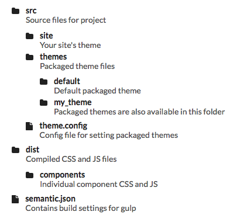
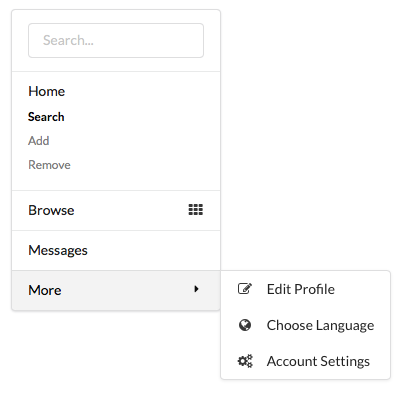
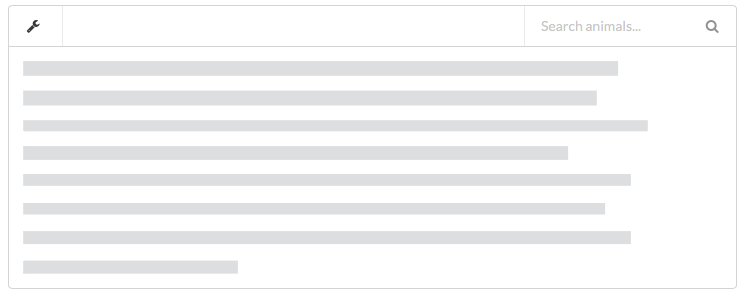

.. _quickstart:

==========
Quickstart
==========

Agile UI framework implements a Web UI standard component library which can
be used in any PHP application or framework. There are 20+ core UI components
and many more are available as part of AgileToolkit.

In this chapter, I will introducing you to the fundamental principles of
using AgileToolkit.

Installing
==========

Agile UI can be installed in any application by simply using Composer::

    require atk4/ui

The above will install the necessary components to proceed with our demo.
If you are using application such as Wordpress or Drupal, you can probably
install "Agile Toolkit" through their plug-in installer.

For a vanilla application, I recommend you downloading the following 
file: ``atk4-test.php`` and opening it inside your browser. You should see
"Hello World", that is generated by the following code::

    $ui = new \atk4\ui\HelloWorld();

    $ui->run();

The first line builds a server-side UI object and the second line renders
and outputs it to your browser using HTML/JavaScript/CSS.

[image with atk logo]

In Agile Toolkit implementation details are abstracted and simplified with
the goal to make building Web User Interface fun.

Introducing a Tree View
=======================

We will be looking into using a Tree view. This components is handy to
building UI depicting folder structure, multi-level outlines or menus:

In Agile Toolkit Views can be loosely arranged into the following 4 groups:

- Single-record (Card, Form)
- Multi-record (List, Table, Grid, Tree, Menu)
- Composite (CRUD)
- and No-record (Button, Label, Hint)

Tree view is designed to render multiple records. Unlike other views in
the multi-record group, Tree deals with hierarchical data structures.

Views read record data from Agile Data Models. For the Tree view, your
data model must be capable of referencing it's own chidren.

Show a Folder Structure
-----------------------

Agile UI depends on Standard library that comes with some of the useful
models and persistences. Model "File" and a persistence "FileSystem"
can be used to read contents of your hard drive which can then be 
visualised by a Tree view::

    $filesystem = new \atk4\std\Persistence\FileSystem('..');
    $file = new \atk4\std\Model\File($filesystem);

    $file->addCondition('is_root', true);

    $ui = new \atk4\ui\View\Tree();
    $ui->setModel($file);

    $ui->run();

This will create a pretty visualisation of your files and folders.

Using different templates
-------------------------

A View implements a specific presentation logic. Views rely on templates
to actually produce HTML output. The same logic can be used with a different
HTML template to produce a differently formatted output::

    $ui = new \atk4\ui\View\Tree('tree/ordered.html');

Template has some of the basic requirements, but it is simple enough
for you to be able to create your own.

Using Static Sources
--------------------

Most UI Views will have a "preferred model" that will be used transparently
if you specify a static data::

    $ui = new \atk4\ui\View\Tree();
    $ui->setData([
        'File 1',
        'File 2',
        ['File 3', 'icon'=>'file excel outline'],
        ['Folder 1', 'children' => ['SubFile1', 'SubFile2']],
    ]);

    $ui->run();

Agile Toolkit recommends that you use a vendor-specific data sources instead
of manually dealing with the data.

Using 3rd party Data Sources
----------------------------

For this example, I will connect 'Tree' with Amazon S3. First you need
to install 'atk4/s3' extension, then use this code::

    $config = ['key'=>'..your key', 'secret'=>'..your secret'];

    $bucket = new \atk4\s3\Persistence\Bucket('my-bucket', $config);
    $file = new \atk4\s3\Model\File($bucket);

    $file->setPath('/');

    $ui = new \atk4\ui\View\Tree();
    $ui->setModel($file);

    $ui->run();

This time model will read data from the S3 bucket. There is a similar
extension for "DropBox" that uses a very similar syntax (atk4/dropbox).

Extending Tree View
-------------------

Other Views can extend Tree. This example uses a more advanced "Menu" view::

    $menu = new \atk4\ui\View\Menu();
    $menu->setData([
        new \atk4\ui\Form\Search(),
        ['Home', 'children'=>[ 
                ['Search', 'is_active'=>true], 'Add', 'Remove'
        ]],
        ['Browse', 'icon'=>'grid layout'],
        'Messages',
        ['More', 'dropdown'=>true, 'children'=>[
            ['Edit Profile', 'icon'=>'edit'],
            ['Choose Language', 'icon'=>'globe'],
            ['Account Settings', 'icon'=>'settings'],
        ]]
    ]);

    $menu->run();

The above code will produce the following Menu:

Tree in a Composite View
------------------------

It is also possible to use Tree as a sub-element inside a composite View. For
instance, 'S3' add-on includes a file-upload UI::

    $config = ['key'=>'..your key', 'secret'=>'..your secret'];

    $bucket = new \atk4\s3\Persistence\Bucket('my-bucket', $config);
    $file = new \atk4\s3\Model\File($bucket);

    $upload = new \atk4\s3\View\Upload(['select_folder'=>true]);
    $upload->setModel($file);

    $upload->run();

Because I have enabled 'select_folder' options, the "Upload" view will fetch
list of folders from my bucket and allow user to pick a location for
the uploaded file. The folder-picker is implemented using a Tree View.

Layouts and Interractivity
==========================

Agile Toolkit is packed with different views that can rely on each-other to
produce consistent UI for your web applications. 

By learning about other Views and understanding how they can be used as a part
of a Layout to provide your Web Application with responsive UI can save you
a lot of time and effort.

My next code builds out an entire part of your web application. Be sure to 
create a folder "myfiles"::

    use \atk4\ui;

    // Define Data Source
    $filesystem = new \atk4\std\Persistence\FileSystem('myfiles');
    $file = new \atk4\std\Model\File($filesystem);
    $file->addCondition('is_root', true);

    $ui = new ui\Segment();

    $dropdown->addItem('New Folder');
    $dropdown->addItem('Upload File');
    $dropdown->addItem('Refresh');

    $search = $menu->addSearch();

    $tree = $ui->add(new ui\Tree());
    $tree->setModel($file);

    $ui->run();

Agile Toolkit is not only for building static interfaces. Each component can also
be fully interractive. Let's look how we can make our initial code more interractive
by adding:

- Events for clicking menu items
- Search form handling
- Interracting with files in a tree-view

Introducing Events
------------------

This section will tell about binding events to dropdown's menu items and creating
custom events for $tree (reload);

Form Handling
-------------

Here we will look at how we can implement filter call-back that would apply condition
to file names.

File Element Clicking
---------------------

Any UI can be made interractive in Agile UI. We will take a Tree view and make its 
elements clickable which will bring up a dialog with file properties.

