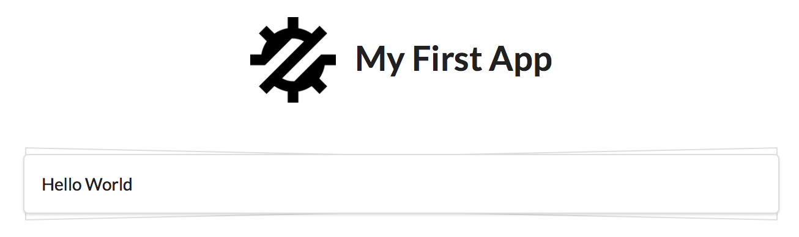

.. _quickstart:

==========
Quickstart
==========

In this section we will demonstrate how to build a very simple web application with just
under 50 lines of PHP code. The important consideration here is that those are the ONLY
lines you need to write. There are no additional code "generated" for you.

At this point you might not understand some concept, so I will provide referenced deeper
into the documentation, but I suggest you to come back to this QuickStart to finish
this simple tutorial.

Requirements
============

Agile Toolkit will work anywhere where PHP can. Find a suitable guide on how to set up
PHP on your platform. Having a local database is a plus, but our initial application will
work without persistent database.

Installing
==========

Start your command-line and execute composer command::

    composer require atk4/ui

Coding "Hello, World"
=====================

Open file `index.php` and add the following code::

    <?php                                     // 1
    require 'vendor/autoload.php';           // 2

    $app = new \atk4\ui\App('My First App'); // 3
    $app->initLayout('Centered');            // 4

    $app->layout->add('HelloWorld');        // 5

.. rubric:: Clarifications

.. [#f1] All PHP files start with `<?php`. I will omit this line in my further examples. There is no need
    to add a matching `?>` at the end.

.. [#f2] Inclusion of `autoload.php` is a standard thing to do when working with PHP / Composer.

.. [#f3] `App` class is represents your web application. This line may change if you integrate Agile UI with other framework.

.. [#f4] Specifies default page layout for your application. Try changing between 'Centered' and 'Admin'

.. [#f5] Creates new component 'HelloWorld' and adds it into Application Layout.

You should see the following output:

Instead of manually outputing a text "Hello, World!" we have used a standard component. This actually brilliantly
demonstrates a core purpose of Agile Toolkit. Instead of doing a lot of things yourself, you can rely on
components that do things for you.

Data Persistence
================

To build our "ToDo" application, we need a good location to store list of tasks. We don't really want to mess with
the actual database and instead will use "SESSION" for storing data.

All components of Agile Data are database-agnostic and will not concern themselve with the way how you store data.
I will start the sesion and connect `persistence <http://agile-data.readthedocs.io/en/develop/persistence.html>`_
with it::

    session_start();
    $s = new \atk4\data\Persistence_Array($_SESSION);

Data Model
==========

We need a class `Task` which decribes `data model <http://agile-data.readthedocs.io/en/develop/model.html>`_ for the
single ToDo item::

    
    class ToDoItem extends \atk4\data\Model {
        public $table = 'todo_item';        // 6
        function init() {
            parent::init();

            $this->addField('name', ['caption'=>'Task Name', 'required'=>true]);
                                            // 7
            $this->addField('due', [
              'type'=>'date',               // 8
              'caption'=>'Due Date', 
              'default'=>new \DateTime('+1 week')   // 9
            ]);
        }
    }

.. rubric:: Clarifications

.. [#f6] $table is a default table/collection/key name when persisting model data.

.. [#f7] Second argument to addField() is optional and can contain field meta-data.

.. [#f8] All Meta-data is stored but some has special meaning - 'type' will specify how UI presents the field

.. [#f9] Business Model is always using native PHP types, regardless of where data is stored.

As you might have noted already, Persistence and Model are defined independently from each-other.

Form and CRUD Components
========================

Next we need to add Components that are capable of manipulating the data::

    $col = $app->layout->add(['Columns', 'divided']);       // 10
    $col_reload = new \atk4\ui\jsReload($col);              // 11

    $form = $col->addColumn()->add('Form');                 // 12
    $form->setModel(new ToDoItem($s));                      // 13
    $form->onSubmit(function($form) use($col_reload) {      // 14
        $form->model->save();                               // 15

        return $col_reload;                                 // 16
    });

    $col->addColumn()                                       // 17
        ->add('Table')                                      
        ->setModel(new ToDoItem($s));                      

.. rubric:: Clarifications

.. [#] We wish to position Form and Table side-by-side, so we use 'Columns' component and
    inject a Semantic UI CSS class "divided" that will appear as a vertical separation line.

.. [#] $col_reload is a speciall object which we call :ref:`js_action`. It represents a Browser-event
    that will cause both columns to be reloaded from the server. To use this action we still have
    to bind it.

.. [#] `Columns` class provides `addColumn()` method to equally divide layout vertically. We call
    this method twice in our example, so two columns will be visible. Method returns a `View` where
    we can add a Form component.

.. [#] `setModel` provides a way to bind Component with Data Model and Data Persistence.

.. [#] `Form` relies on a special Callback feature of Agile UI to automatically handle onSubmit
    call-back, pre-load form values into the model, so that you could simply

.. [#] Save the record into that session data. Form automatically captures validation errors.

.. [#] We use `$col_reload` which we defined earlier to instruct client browser on what it needs to
    do when form is successfully saved.

.. [#] Very similar syntax to what we used with a form, but using with a Table for listing records.

It is time to test our application in action. Use the form to add new record data. Saving the form
will cause table to also reload revealing new records.

Grid and CRUD
=============

As mentioned before, UI Components in Agile Toolkit are often interchangeable, you can swap one for
another. In our example replace right column (label 17) with the following code::

    $grid = $col->addColumn()->add(['CRUD', 'paginator'=>false, 'ops'=>[    // 18
        'c'=>false, 'd'=>false                              // 19
    ]]);
    $grid->setModel(new ToDo($s));

    $grid->menu->addItem('Complete Selected',               // 20
        new \atk4\ui\jsReload($grid->table, [               // 21
            'delete'=>$grid->addSelection()->jsChecked()    // 22
        ])
    );

    if (isset($_GET['delete'])) {                           // 23
        foreach(explode(',', $_GET['delete']) as $id) { 
            $grid->model->delete($id);                      // 25
        }
    }

.. rubric:: Clarifications

.. [#] We replace 'Table' with a 'CRUD'. This is much more advanced component, that wraps
    'Table' component by providing support for editing operations and other features like
    pagination, quick-search, etc.

.. [#] Disable create and delete features, since we have other ways to invoke that (form and checkboxes)

.. [#] Grid comes with menu, where we can add items.

.. [#] You are already familiar with jsReload action. This time we only wish to reload Grid's Table as
    we wouldn't want to loose any form content.

.. [#] Grid's `addSelection` method will add checkbox column. Implemented through TableColumn\Checkbox
    this object has method jsChecked() which will return another Action for collecting selected checkboxes.
    This demonstrates how Actions can be used as JavaScript expressions augmented by Components.

.. [#] Reload events will execute same originating PHP script but will pass aditional arguments. In this
    case, 'delete' get argument is passed.

.. [#] We use the IDs to dispose of completed tasks. Since that happens during the Reload event, the
    App class will carry on with trigering the necessary code to render new HTML for the $grid->table,
    so it will reflect removal of the items.

Conclusion 
==========

We have just implemented a full-stack application with a stunning UI, advanced use of JavaScript, Form
validation and reasonable defaults, calendar picker, multi-item selection in the grid with ability to
also edit records through a dynamically loaded dialog.

All of that in about 50 lines of PHP code. More importantly, this code is portable, can be used anywhere
and does not have any complex requirements. In fact, we could wrap it up into an individual Component
that can be invoked with just one line of code::

    $app->layout->add(new ToDoManager())->setModel(new ToDoItem());

Just like that you could be developing more components and re-using existing ones in your current
or next web application.

More Tutorials
==============

If you have enjoyed this tutorial, we have prepared another one for you, that builds a multi-page
and multi-user application and takes advantage of database expressions, authentication and introduces
more UI components:

 - https://github.com/atk4/money-lending-tutorial 
 - (Demo: https://money-lending-tutorial.herokuapp.com)

